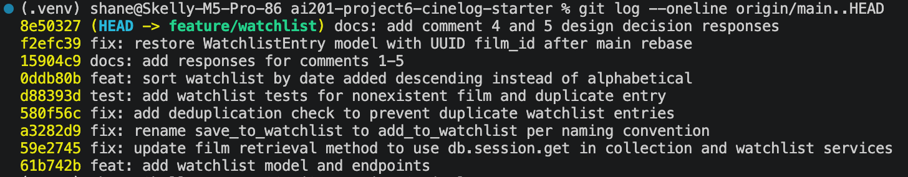

# PR Response Doc — CineLog Watchlist Feature

## AI Usage
I used AI for codebase orientation and for stress-testing my design arguments — not to write the decisions.
- **Orientation:** I had AI summarize `collection_service.py` and explain how `add_to_collection`'s deduplication check works, so I could mirror that exact pattern in `add_to_watchlist` rather than inventing my own. I verified the explanation against the actual code before implementing.
- **Stress-testing Comments 4 and 5:** After writing my own positions (private-by-default; date-added sort), I asked AI what counterargument a reviewer would raise. For Comment 4 it surfaced the "a social platform defaulting to private undercuts discovery" objection; I already had the tradeoff acknowledged, and I sharpened my reasoning to note that opt-in sharing produces higher-signal discovery. The core positions and reasoning are my own.
- **Commit hygiene:** I had AI confirm my `git log --oneline` used conventional commit format and check whether any commit bundled multiple logical changes, then verified against the conventional commits spec myself.

## Comment 1 — Rename
**What I did:** Renamed `save_to_watchlist()` to `add_to_watchlist()` in `services/watchlist_service.py` to follow the project's verb_to_noun naming convention, matching `add_to_collection()`. Updated the one call site in `routes/watchlist/watchlist.py` — both the import and the call inside `add_film()`.
**How I verified:** Ran `grep -rn "save_to_watchlist" . --include="*.py"` across the project (excluding `.venv`) to confirm no references to the old name remained — it returned nothing. Then ran `pytest tests/ -v`; all tests still pass.

## Comment 2 — Deduplication
**What I did:** Added a duplicate check to `add_to_watchlist()` mirroring the pattern in `add_to_collection()`. Before inserting, it queries `WatchlistEntry.query.filter_by(user_id=user_id, film_id=film_id).first()`; if a row already exists it raises a new `AlreadyInWatchlistError` instead of committing a second entry. I defined `AlreadyInWatchlistError` as a watchlist-specific exception, paralleling the collection service's `AlreadyInCollectionError`, rather than reusing the collection exception, so the error names stay domain-accurate.
**How I verified:** In a Python shell against an in-memory DB, I added the same film twice for one user; the first call succeeded and the second raised `AlreadyInWatchlistError` as intended. Then ran `pytest tests/ -v` to confirm no existing tests broke. (A dedicated automated test follows in Comment 3.)

## Comment 3 — Missing test
**What I did:** Created `tests/test_watchlist.py` following the fixture and assertion structure of `tests/test_collection.py`. Added `test_add_to_watchlist_nonexistent_film_raises`, the direct equivalent of `test_add_to_collection_nonexistent_film_raises`: it calls `add_to_watchlist` with a film_id that doesn't exist and asserts `FilmNotFoundError` is raised. Reused the same `app`, `sample_user`, and `sample_film` in-memory fixtures.
**How I verified:** Ran `pytest tests/test_watchlist.py -v` (passes) and `pytest tests/ -v` (all 6 pass — 4 collection + 2 watchlist).

## Comment 4 — Default visibility
**My position:** A new watchlist should default to `public=False` (private).
**Reasoning:** A watchlist is save-for-later — films you haven't watched yet — which is more personal than a collection of films you've already watched and chose to rate. People save embarrassing or guilty-pleasure movies, or films they don't want to be ridiculed for not having seen. Defaulting to private is the safer, more intentional choice: with public-by-default, by the time a user realizes they didn't want a list exposed, others may already have seen it — the exact "accidental exposure" the maintainer flagged. Private-by-default means no list is ever visible without the user affirmatively choosing to share, which is a deliberate action rather than an inherited default.
**Tradeoff acknowledged:** This makes CineLog less social out of the box. If most users never flip their lists to public, the social-discovery side of the platform gets thinner, since sharing now requires an opt-in step instead of happening automatically.

## Comment 5 — Sort order
**My position:** Agree with the maintainer — switch from alphabetical to date-added, descending (newest first).
**Reasoning:** A watchlist is a queue, not a reference table — you're deciding what to watch next, not looking up a title you already know, so chronological order fits the actual use better than alphabetical. Newest-first also matches the established house pattern: `get_collection()` already sorts by `date_added.desc()`, so alphabetical was actually the odd one out in the codebase. My own use case: when a new film comes out and I add it, I want it near the top so I can watch it soon and avoid getting spoiled on social media — newest-first serves that directly.
**Engagement with reviewer's point:** The maintainer wanted date-added because "most users want to see what they added recently," and Dani-risingBW raised the opposite journey — finding the oldest save to finally mark it off. Date-added ordering serves both: recent saves sit at the top, and the oldest ones are a scroll to the bottom. I chose descending over ascending because it matches `get_collection` and answers the "what did I just add" case first, while still keeping the mark-off-the-oldest case reachable. Alphabetical served neither journey, which is why I didn't keep it.

## Comment 6 — Rebase
**What conflicted:** After the main-branch refactor migrated film IDs from integer to UUID, my watchlist code still assumed integer film IDs. When I rebased `feature/watchlist` onto `origin/main`, git replayed my commits onto main's rewritten `models.py`. Because main had rewritten the same file that my first commit added `WatchlistEntry` to, the replay kept main's version and dropped my `WatchlistEntry` class entirely — a semantic loss git did not flag as a textual conflict. My `WatchlistEntry.film_id` had also been declared as `db.Integer`, incompatible with the now-UUID `Film.id`.
**How I resolved it:** I re-added the `WatchlistEntry` model to the post-refactor `models.py` with `film_id = db.Column(db.String(36), db.ForeignKey("film.id"))` so it matches the UUID `Film.id`. I also updated the now-stale docstrings in `watchlist_service.py` and `routes/watchlist/watchlist.py` that still described `film_id` as an integer. The service logic and blueprint registration in `app.py` survived the rebase intact.
**How I verified no conflict remains:** Ran `pytest tests/ -v` — all 6 tests pass, including the watchlist tests that import `WatchlistEntry` (the import error caused by the dropped model is gone). Confirmed `git log --oneline origin/main..HEAD` shows my commits replayed on top of main with no merge commit.

## Stretch — Second test
I added a second watchlist test beyond what the review requested: `test_add_to_watchlist_duplicate_raises`. I chose the duplicate-entry edge case because deduplication (Comment 2) is the watchlist's most behavior-critical guard — a silent duplicate would corrupt the list and isn't caught by the nonexistent-film test. The test adds the same film twice for one user, asserts `AlreadyInWatchlistError` is raised on the second call, and confirms exactly one row exists in the database afterward, matching the assertion style of `test_add_to_collection_duplicate_raises`.

## PR Description

### What this feature does
Adds a watchlist to CineLog so users can save films they want to watch later (distinct from the collection, which tracks films already watched). Includes a `WatchlistEntry` model, service functions (`add_to_watchlist`, `get_watchlist`), and REST endpoints (`GET /watchlist/<user_id>`, `POST /watchlist/<user_id>/add`). Adding a film that's already on the list raises `AlreadyInWatchlistError` instead of creating a duplicate.

### Design decisions
- **Default visibility:** New watchlists default to `public=False` (private). A watchlist is save-for-later and more personal than a watched-and-rated collection, so privacy-by-default avoids accidental exposure; users who want to share opt in explicitly. (Full reasoning under Comment 4 above.)
- **Sort order:** `get_watchlist` returns entries by `date_added` descending (newest first), replacing the original alphabetical sort. A watchlist is a queue, not a reference table, and this matches the existing `get_collection` pattern. (Full reasoning under Comment 5 above.)

### How to manually test
1. Set up and run: `python -m venv .venv && source .venv/bin/activate && pip install -r requirements.txt`, then `python app.py`.
2. You'll need a valid user_id and film_id (UUIDs) from the seeded database.
3. Add a film to the watchlist:
```
curl -X POST http://127.0.0.1:5000/watchlist/<user_id>/add \
  -H "Content-Type: application/json" \
  -d '{"film_id": "<film_uuid>"}'
```
   Expect a `201` with the new entry.
4. Add the same film again — expect it to be rejected as a duplicate (no second entry created).
5. View the watchlist:
```
curl http://127.0.0.1:5000/watchlist/<user_id>
```
   Expect the films returned newest-added first.
6. Run the test suite: `pytest tests/ -v` — all tests pass, including `test_add_to_watchlist_nonexistent_film_raises` and `test_add_to_watchlist_duplicate_raises`.

## Commit History

